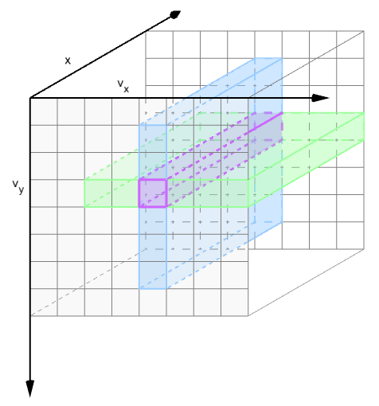
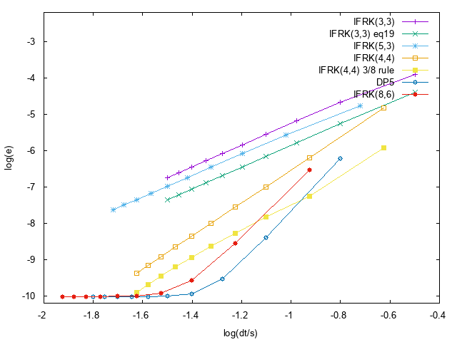

# À propos de la résolution numérique de Vlasov-Poisson

> Il ne s'agit pas ici d'effectuer toute la théorie de la résolution de l'équation de Vlasov-Poisson mais plus de présenter les choix que nous avons pu effectuer dans la résolution numérique, et les implications que cela peut avoir sur l'implémentation.

Nous souhaitons résoudre un problème du type :

$$
  \begin{cases}
    \partial_t f + v\partial_x f + E\cdot\nabla_v f = 0 \\
    \partial_x E = \rho - 1
  \end{cases}
$$

avec $f(t=0,x,v) = f^0(x,v)$, $x\in [x_{\text{min}},x_{\text{max}})$ périodique, et $v\in\mathbb{R}^d$. 

Pour représenter au mieux le domaine de $v$ il est nécessaire de borner l'intervalle et prendre $v\in [v_{\text{min}},v_{\text{max}}]$. Pour simplifier l'implémentation des conditions aux bords, nous prendrons un domaine périodique, des conditions aux bords de Neumann ont déjà été testé sur le même type de problème, sans impact sur la solution.

## Méthode de résolution

Pour capturer la filamentation nous avons opté pour un schéma d'ordre élevé dans l'espace des phases : WENO d'ordre 5. L'étude de la CFL pour ce schéma avec différentes discrétisations en temps a déjà été effectué pour ce schéma [ici](cfl.ipynb). La CFL est guidé par $v_{\text{max}}$ et $E_{\text{max}}$ or $v_{\text{max}}$ est pris arbitrairement grand pour approximer au mieux les intégrales en vitesse. Nous avons donc :

$$
  E_{\text{max}} \ll v_{\text{max}}
$$

Par conséquent, pour pouvoir choisir le plus grand pas de temps possible il est intéressant de résoudre différemment le transport dans la direction $x$, à savoir à l'aide d'une transformée de Fourier :

$$
  \partial_t \hat{f} + vi\kappa\hat{f} + \widehat{(E\cdot\nabla_v f)} = 0
$$

Ce que l'on peut réécrire, pour utiliser un schéma Runge-Kutta exponentiel :

$$
  \partial_t (e^{iv\kappa t}\hat{f}) = - e^{iv\kappa t}\widehat{(E\cdot\nabla_v f)}
$$

Ainsi nous n'utiliserons le schéma WENO uniquement pour l'approximation de $E\cdot\nabla_v f$, donc pour estimer une dérivée en vitesse. La CFL sera alors guidé par $E_{\text{max}}$ qui n'est que de quelques unités. Ainsi le pas de temps $\Delta t$ imposé par cette CFL est le plus grand possible.

Cette équation peut être résolu par la méthode IFRK ([Isherwood L. et al](https://github.com/Kivvix/miMaS/blob/master/bibliography/pdf/2018-Isherwood(1).pdf)), qui est une méthode exponentielle basée sur RK, ainsi le schéma pour résoudre $u_t = Lu + N(u)$ où $L$ représente un opérateur linéaire (dans notre cas la multiplication par $-vi\kappa$) et $N$ un opérateur non-linéaire (ici le schéma WENO sur la FFT inverse), le schéma IFRK basé sur RK de Shu-Osher s'écrit alors :

$$
  \begin{aligned}
    u^{(1)} &= e^{L\Delta t}u^n + e^{L\Delta t}\Delta t N(u^n) \\
    u^{(2)} &= \frac{3}{4}e^{\frac{1}{2}L\Delta t}u^n + \frac{1}{4}e^{-\frac{1}{2}L\Delta t}u^{(1)} + \frac{1}{4}e^{-\frac{1}{2}L\Delta t}\Delta t N(u^{(1)}) \\
    u^{n+1} &= \frac{1}{3}e^{L\Delta t}u^n + \frac{2}{3}e^{\frac{1}{2}L\Delta t}u^{(2)} + \frac{2}{3}e^{\frac{1}{2}L\Delta t}\Delta t N(u^{(2)})
  \end{aligned}
$$

En appliquant ce schéma à notre équation :

$$
  \partial_t \hat{f} + vi\kappa\hat{f} + \widehat{(E\cdot\nabla_v f)} = 0
$$

on obtient le schéma suivant :

$$
  \begin{aligned}
    \hat{f}^{(1)} &= e^{-vi\kappa\Delta t}\hat{f}^n + e^{-vi\kappa\Delta t}\Delta t \widehat{(-E\cdot\nabla_v f^n)^{\texttt{W}}} \\
    \hat{f}^{(2)} &= \frac{3}{4}e^{-\frac{1}{2}vi\kappa\Delta t}\hat{f}^n + \frac{1}{4}e^{\frac{1}{2}vi\kappa\Delta t}f^{(1)} + \frac{1}{4}e^{\frac{1}{2}vi\kappa\Delta t}\Delta t \widehat{(-E\cdot\nabla_v f^{(1)})^{\texttt{W}}} \\
    \hat{f}^{n+1} &= \frac{1}{3}e^{-vi\kappa\Delta t}\hat{f}^n + \frac{2}{3}e^{-\frac{1}{2}vi\kappa\Delta t}f^{(2)} + \frac{2}{3}e^{-\frac{1}{2}vi\kappa\Delta t}\Delta t \widehat{(-E\cdot\nabla_v f^{(2)})^{\texttt{W}}}
  \end{aligned}
$$

## Choix d'implémentation

Nous souhaitons traiter des problèmes 1D$x$,$N_v$D$v$. La résolution en $x$ s'effectue avec un schéma global, il est donc intéressant de stocker de manière continue les données dans cette direction. En $v$ nous utiliserons le schéma WENO qui utilise un stencil de 5 pour évaluer $f_{i,k+\frac{1}{2}}^+$, nous utiliserons un stencil de 6 pour évaluer conjointement $f_{i,k+\frac{1}{2}}^+$ et $f_{i,k+\frac{1}{2}}^-$.



Pour des raisons de performance il est intéressant d'envoyer 6 itérateurs à une fonction `local_flux` pour calculer les valeurs de $f_{i,k+\frac{1}{2}}^+$ et $f_{i,k+\frac{1}{2}}^-$, et d'itérer dans un premier temps en $x$ (selon `i`).

Bien qu'utilisant le même stencil, je n'ai pas souhaité évaluer simultanément $f_{i,k+\frac{1}{2}}^+$ et $f_{i,k-\frac{1}{2}}^-$ pour des raisons de gestion des conditions aux bords lors de l'approximation de la dérivée à l'aide des flux :

$$
  \partial_v f \approx E^+_i (f_{i,k+\frac{1}{2}}^+ - f_{i,k-\frac{1}{2}}^+) + E^-_i (f_{i,k+\frac{1}{2}}^- - f_{i,k-\frac{1}{2}}^-)
$$

l'évaluation aux bords `k=0` et `k=Nv` auraient nécessités des cas particulier, avec cette méthode seul le bord `k=0` est traité à part.

Il est intéressant de stocker les flux $f_{i,k+\frac{1}{2}}^\pm$ dans un seul tableau de pairs : `fik12pm`, cela évite d'accéder à la mémoire au milieu de 2 tableaux, ainsi le stresse de la mémoire est (sans doute) plus faible.

```c++
  dvf[k][i] = Ep[i]*( fik12pm[k][i].first - fik12pm[k-1][i].first ) + Em[i]*( fik12pm[k][i].second - fik12pm[k-1][i].second );
```

> Pour obtenir facilement le tableau des $(f_{i,k})_i$ en `C++` il est nécessaire que le dernier indice soit celui que l'on veut de manière continue, ainsi `f[k]` représente le tableau souhaité.

Pour plus de facilité pour l'implémentation, et un potentiel passage aux dimensions supérieurs ($N_v > 1$, mais toujours une seule dimension en position), il a été décidé d'utiliser la classe `boost::multi_array<T,NumDims>` (avec `NumDims = 1 + Nv`). Pour le stencil il est possible d'utiliser un `boost::zip_iterator` sur les 6 valeurs du stencil, et itéré dessus dans la direction $x$ pour calculer les $\left(f_{i,k+\frac{1}{2}}^+,f_{i,k+\frac{1}{2}}^-\right)_i$. Utiliser des itérateurs pour représenter le stencil ne limite pas à l'utilisation de données dans le cube de données, il est possible d'avoir un vecteur comportant les données au bord, voir un `constant_iterator` permettant d'itérer sur la même valeur.

> Un petit *benchmark* du code avec `callgrind` m'a permis de remarquer qu'un peu plus de la moitié du temps est passé dans le calcul du WENO. Le *callgraph* est plutôt équilibré dans l'ensemble, ce qui est bon signe. Le goulot d'étranglement dans la méthode WENO est uniquement le déréférencement du `boost::zip_iterator`, une structure *maison* avec seulement 5 itérateurs qui permet simplement d'encapsuler ceci permettrait peut-être de gagner un peu de temps.

## Choix du schéma en temps

Nous choisissons un schéma de Lawson comme discrétisation en temps. L'obtention d'un tel schéma s'obtient lorsque l'on cherche à résoudre un problème du type :

$$
  \dot{u} = Lu + N(u)
$$

dans le cas de Vlasov-Poisson, $u \mapsto \hat{f}$, $L\mapsto i v_k \kappa$ et $N(u)\mapsto \widehat{(E\cdot\nabla_v f)}$. Les schémas de Lawson correspondent à l'écriture d'un schéma RK sur :

$$
  \partial_t(e^{-Lt}u) = e^{-Lt}N(u)
$$

Par substitution, il est possible de *Lawsoniser* tout type de schéma RK de manière algorithmique. Un script a donc été écrit pour effectuer ce processus de manière automoatique sur des schémas à plusieurs étages : RK(3,3), RK(5,3), RK(4,4) , RK(4,4) règle des 3/8, DP5 et RK(8,6).

Nous savons que notre système préserve l'énergie $H(t)$ :

$$
  H(t) = \int v^2f\,\mathrm{d}v\mathrm{d}x + \int E^2\,\mathrm{d}x
$$

Il est donc possible de mesurer au cours du temps l'erreur relative effectuée sur cette quantité :

$$
  \mathcal{E}(\Delta t) = \left|\left|\left(\frac{H(t^n)-H(0)}{H(0)}\right)_{\Delta t}\right|\right|_{\infty}
$$

Nous pouvons ainsi mesurer l'ordre de chacun de nos schémas, et comparer les erreurs en fonction du coût numérique $\frac{\Delta t}{s}$ où $s$ correspond au nombre d'étages de la méthode considérée. On obtient alors sur le cas test BoT le graphique suivant.



