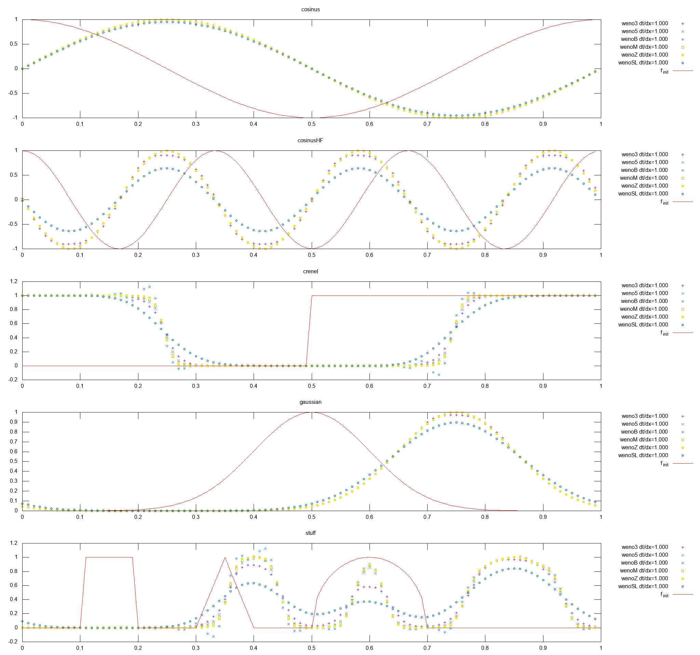
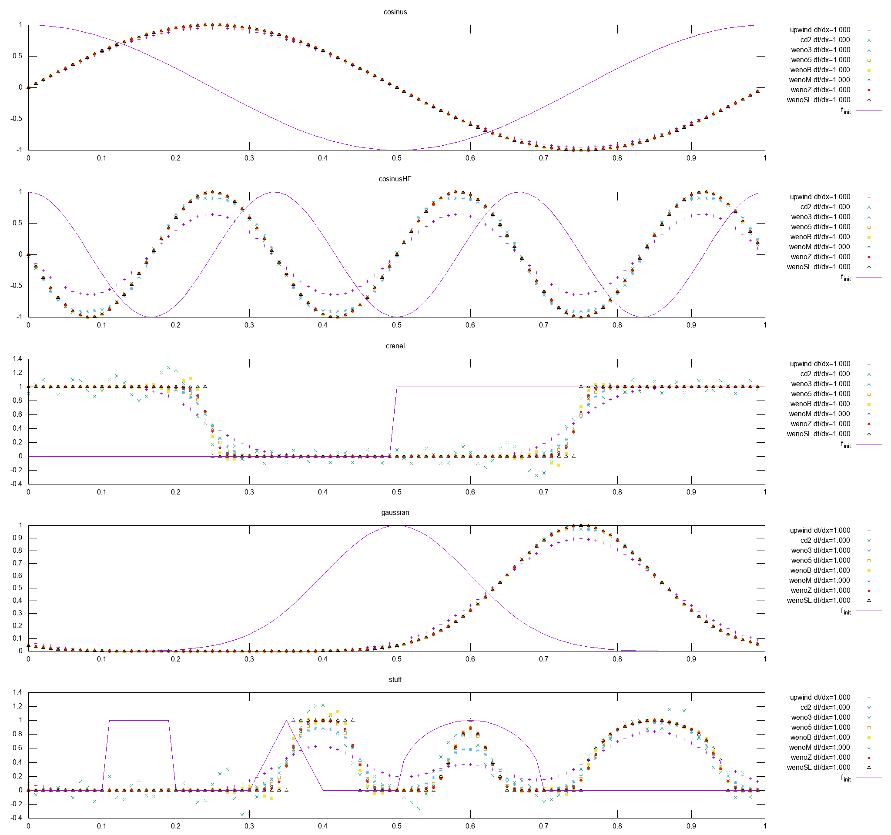
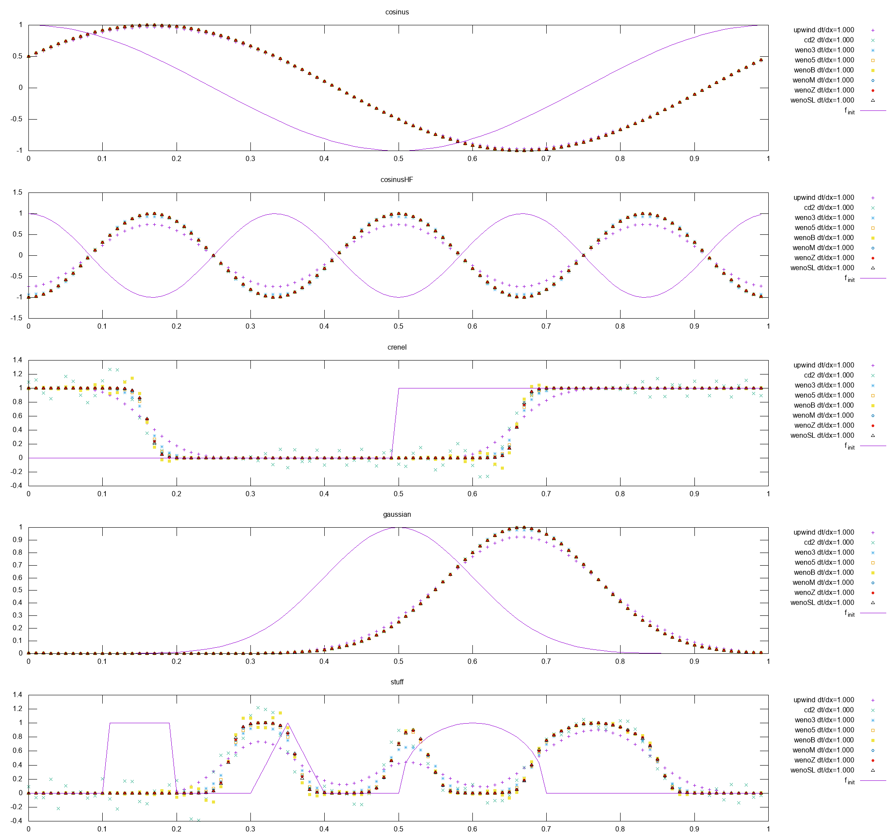

# 2019-11-06

J'ai implémenté le WENO-SL (semi-Lagrangien) dans un code de test 1Dx, de transport à vitesse à vitesse constante, etc. Le WENO-SL est décrit dans [Qiu:2011](https://doi.org/10.1016/j.jcp.2010.04.037) ou [Qiu:2010](https://doi.org/10.1016/j.jcp.2009.10.016).

Simulation de :
$$
  u_t + u_x = 0
$$
avec $T_f=0.25$, $\Delta x=\frac{1}{100}$, $x\in[0,1]$ (périodique), RK(4,4) comme intégrateur en temps et 5 condtions initiales différentes : une période de c

On remarque que le schéma WENO3 diffuse un peu plus que les autres WENO d'ordre 5 : WENO5 (qui est le WENO standard WENO-JS), WENO-M et WENO-Z, on remarque que le WENO-B de Banks oscille (constatation déjà faite). Le WENO-SL diffuse encore plus que les autres. Je trouve ce résultat relativement étrange, je n'épargne donc pas une erreur dans mon implémentation.

La présentation du WENO-SL est faite avec comme intégrateur en temps du Euler explicite. Puisqu'il est nécessaire de faire *entrer* du $\Delta t$ dans la méthode WENO-SL, je ne sais pas si cela se mêle correctement avec un autre intégrateur en temps (comme RK(4,4) utilisé dans cette simulation).

## Correction/compréhension de WENO-SL

En réalité, dans la construction de la méthode WENO-SL, la discrétisation s'effectue simultanément en temps et en espace, il n'y a pas d'intégrateur en temps à proprement parlé, dans mon code de simulation de test 1D cela revient à utiliser une méthode d'Euler explicite et de diviser l'approximation $u_x$ par $\Delta t$. On obtient alors des résultats plus cohérent (correction effectuer jeudi à 14h).

On remarque alors que le WENO-SL donne un très bon résultat sur une discontinuité, bien meilleur que WENO-Z (qui est une optimisation du WENO5 classique WENO-JS pour minimiser la diminution d'ordre lors d'une discontinuité). Ce résultat est trompeur car le transport s'effectue à vitesse 1, donc une méthode semi-lagrangienne est considérée comme exacte.
Je n'ai pas effectué de mesure d'ordre sur ce schéma (ordre en espace et en temps du coup ?).

Résolution de :
$$
  u_t + \frac{2}{3}u_x = 0
$$

Avec les mêmes paramètres numériques.

Dans ces conditions, WENO-SL fait aussi bien que WENO-Z. Un test similaire a été effectué avec une vitesse négative $-\frac{2}{3}$, et on retrouve bien les mêmes résultats. Cela permet de vérifier l'implémentation des flux, puisque dépendant du signe de la vitesse.

