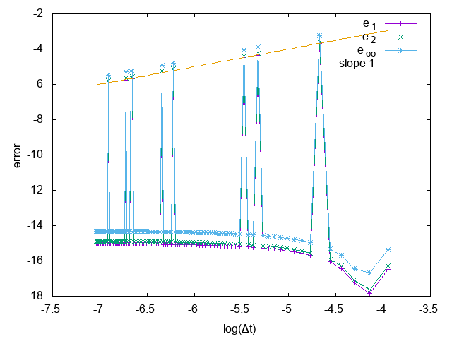
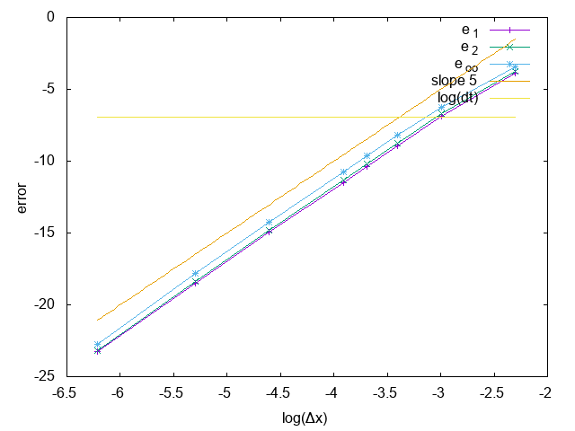

# 2019-11-08

## Compte-rendu avec Nicolas

J'ai commencé à étudier l'ordre en temps (normalement exact) et en espace (normalement d'ordre 5) du WENO-SL, mais mon résultat préliminaire me donnait un schéma d'ordre 1 en temps et d'ordre 5 en espace (avec une erreur qui sature très vite à $\log(\Delta t)$. Mon erreur dans le code provient (vraisemblablement) du fait que je choisis des $\Delta t$ qui dépendent de $\Delta x$, ce qui implique un nombre d'itération $\frac{T_f}{\Delta t}$ non entier. Je dois donc faire en sorte, pour les 2 mesures d'ordre, d'avoir $\frac{T_f}{\Delta t}\in\mathbb{N}$.

On a également discuté du schéma de Lawson pour VPHL. J'avais laissé tombé les calculs pour la non-linéarité $\dot{\Lambda}$ avec un terme extra-diagonal, car je ne trouvais pas de forme simple car les matrices ne commutent pas. En détaillant chaque terme des matrices avec Nicolas, il semblerait possible d'avoir une forme exploitable pour l'étude généralisée des ordres supérieur à 1.

On a longuement discuté de WENO-SL et de son interprétation comme une interpolation semi-lagrangienne. La version de WENO-SL par Qiu continue de faire apparaître des flux et non une interpolation. La version semi-lagrangienne par Francis Filbet semble plus sympathique, mais utilise des polynômes de Hermite, et donc à un moment une approximation de la dérivée de $u$. Je dois me replonger un peu plus dans les papiers de Shu sur la construction de WENO, pour être certain de la construction des flux et l'interprétation que Nicolas veut en faire comme une interpolation (pour retrouver une méthode semi-lagrangienne).

> TODO:
>
> - [x] corriger le script pour obtenir l'ordre en $t$ et $x$
> - [x] calculer les valeurs propres de $e^{tA}$ pour être certain du résultat donné par `sympy` : $\left|\left|e^{tA} \right|\right|_2 = 1$
> - [ ] comparer les polynômes d'interpolation de WENO (et comprendre comment on les calcule), et comparer la version linéarisé avec le polynôme d'interpolation du semi-lagrangien. Voir [papier de Francis sur du HWENO](https://www.math.univ-toulouse.fr/~ffilbet/Papers/paper38.pdf) (pour WENO semi-lagrangien avec polynôme de Hermite).

## Avancement sur les petits trucs à vérifier

- L'erreur est bien constante avec $\Delta t$, et on atteint l'erreur numérique. En $x$ on retrouve bien la pente de 5, et n'est pas saturé par $\Delta t$.
- Les valeurs propres de $e^{-tA}$ sont $e^{-itkv}$ et $\cos(t) \pm i\sin(t)$. Ceci nous donne bien des valeurs propres de module 1.

  

  

