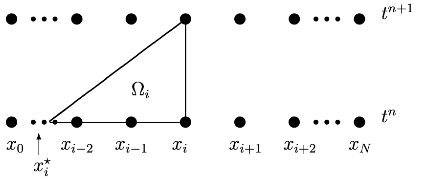

# 2019-12-12

Étudions le WENO-SL présenté par Qiu et Shu dans \[[Qiu:2011](https://github.com/Kivvix/miMaS/blob/master/bibliography/pdf/2011-Qiu.pdf)\]. Il s'agit d'une méthode volumes finis semi-Lagrangienne. Pour cela on s'intéresse à l'équation :
$$
  u_t + (au)_x = 0
$$
On commence par une intégration sur $[t^n,t^{n+1}]$ :
$$
  u(t^{n+1},x) = u(t^n,x) - \left(\int_{[t^n,t^{n+1}]}au(\tau,x)\,\mathrm{d}\tau\right)_x
$$
soit :
$$
  u_i^{n+1} = u_i^n - \mathcal{F}_{x|x=x_1}
$$
où $\mathcal{F}$ est défini par :
$$
  \mathcal{F}(x) = \int_{[t^n,t^{n+1}]} au(\tau,x)\,\mathrm{d}\tau = \frac{1}{\Delta x}\int_{[x-\frac{\Delta x}{2},x+\frac{\Delta x}{2}]}\mathcal{H}(\xi)\,\mathrm{d}\xi
$$
Cela nous permet dans un premier temps de réécrire la dérivée par rapport à $x$ de $\mathcal{F}$ (ce que l'on doit calculer pour écrire notre schéma en temps) comme une différence de flux (méthode des volumes finis) :
$$
  \mathcal{F}_x = \frac{1}{\Delta x}\left(\mathcal{H}\left(x+\frac{\Delta x}{2}\right) - \mathcal{H}\left(x-\frac{\Delta x}{2}\right) \right)
$$
D'où l'écriture de :
$$
  u_i^{n+1} = u_i^n - \frac{1}{\Delta x}\left(\mathcal{H}(x_{i+\frac{1}{2}}) - \mathcal{H}(x_{i-\frac{1}{2}})\right)
$$

D'un autre côté, on intègre sur le domaine triangulaire $\Omega_i$ défini par les trois points $(x_i,t^{n+1})$, $(x_i,t^n)$ et $(x_i^\star,t^n)$ (voir figure pour plus d'informations), l'équation de départ.

Le point $x_i^\star$ est défini comme le pied de la caractérisitique issue de $x_i$. Par intégration de l'équation sur $\Omega_i$ :

$$
  \int_{\Omega_i} u_t + (au)_x = 0
$$

par le théorème de Green, on obtient directement (dans l'article ils utilisent le théorème de la divergence, mais je ne comprends pas alors comment est gérer le bord $(x_i^\star,t^n)$,$(x_i,t^{n+1})$) :
$$
  \int_{\Omega_i} u_t + (au)_x = -\int_{x_i^\star}^{x_i} u(t^n,\xi)\,\mathrm{d}\xi + \int_{t^n}^{t^{n+1}} au(\tau,x_i)\,\mathrm{d}\tau 
$$
ce qui nous donne :
$$
  \int_{x_i^\star}^{x_i} u(t^n,\xi)\,\mathrm{d}\xi =  \int_{t^n}^{t^{n+1}} au(\tau,x_i)\,\mathrm{d}\tau = \mathcal{F}(x_i) 
$$
avec (méthode des volumes finis oblige) $\mathcal{F}(x_i) = \bar{\mathcal{H}}_i$ (valeur moyenne de $\mathcal{H}$ sur la cellule $[x_{i-\frac{1}{2}},x_{i+\frac{1}{2}}]$). Donc on utilise le pied exacte de la caractéristique $x_i^\star$ pour faire une estimation du flux, on construit donc une méthode volumes finis semi-lagrangienne.

Il est nécessaire de reconstruire les $\{\bar{\mathcal{H}}_i\}_{i=1}^N$ à partir des $\{u_i^n\}_{i=1}^N$, plus précisemment les points nécessaires sont :
$$
  \bar{\mathcal{H}}_i = \mathcal{R}[x_i^\star,x_i](u_{i-p_1}^n,\dots,u_{i+q_1}^n)
$$
où $\mathcal{R}[a,b]$ est la reconstruction de $\int_{[a,b]}u(t,\xi)\,\mathrm{d}\xi$, en utilisant les points indiqués dans le *stencil* entre parenthèses. Le problème que l'on peut remarqué avec cette méthode volumes-finis/semi-lagrangienne est qu'il est nécessaire d'avoir tous les points entre $x_i^\star$ et $x_i$, aussi loin soit $x_i^\star$. Dans la pratique, lors de l'écriture du schéma, seul le stencil autour de $x_i^\star$ est nécessaire, mais pour conserver la formulation volumes-finis, il est nécessaire de considérer la reconstruction jusqu'à $x_i$.

La suite de l'articule est tout un jeu de construction de l'opérateur de reconstruction $\mathcal{R}[a,b]$ en utilisant une méthode WENO, dans un premier temps avec $x_i^\star$ dans la cellule $[x_{i-1},x_i]$ (volumes finis classiques), puis en dehors de cette cellule (avec la prise en compte de $\xi=\frac{x_{i^\star}-x_i^\star}{\Delta x}$, donc un vrai WENO-SL).

Ce que j'ai pour le moment implémenté le [2019-11-06](#correctioncompréhension-de-weno-sl) n'est que la version où $x_i^\star$ est dans la cellule $[x_{i-1},x_i]$.

