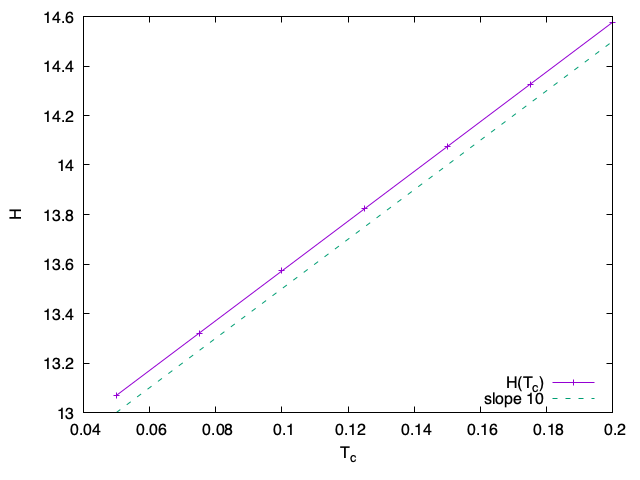
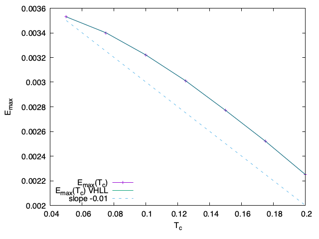
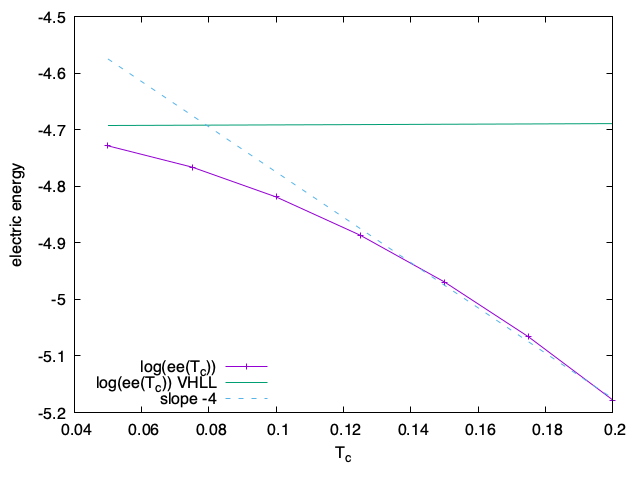
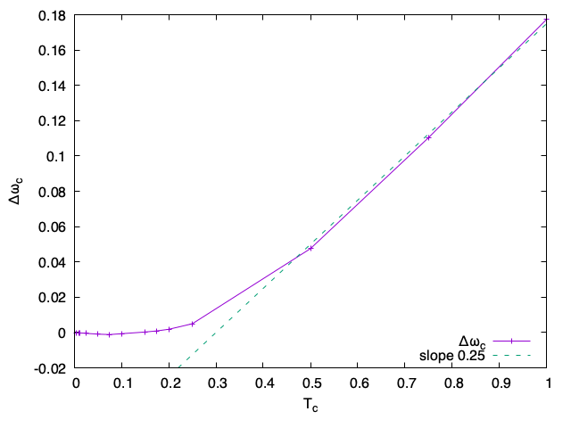
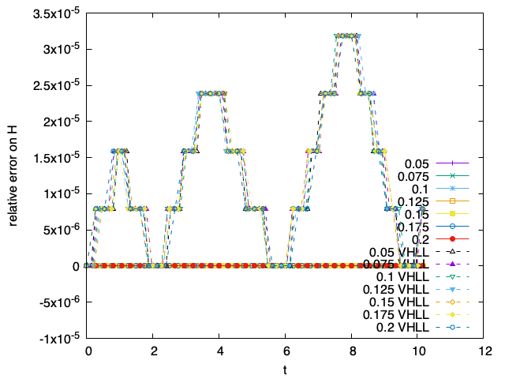

# 2020-01-10

Calcul de l'énergie au cours du temps :
$$
  \begin{aligned}
    \mathcal{E}(t) & = \iint v^2f\,\mathrm{d}v\mathrm{d}x + \int E^2\,\mathrm{d}x \\
                   & = \mathcal{E}(0)
  \end{aligned}
$$

Dans le cas cinétique, $f(t=0,x,v) = \mathcal{M}_{1-\alpha,0,T_c}(v) + \left( \mathcal{M}_{\alpha/2,u,1}(v) + \mathcal{M}_{\alpha/2,-u,1}(v) \right)$, ce qui donne :
$$
  \mathcal{E}_K(t) = \left[ (1-\alpha)T_c + \alpha u^2 + \alpha \right] L
$$

> La perturbation avec le cosinus passe à la trape car par intégration sur tout le domaine en $x$ cela donnera $0$.

Dans le cas hybride linéarisé, $f(t=0,x,v) = (1-\alpha)\delta_0 (v) + \left( \mathcal{M}_{\alpha/2,u,1}(v) + \mathcal{M}_{\alpha/2,-u,1}(v) \right)$, ce qui donne :
$$
  \mathcal{E}_{HL} = \left[ \alpha u^2 + \alpha \right]L
$$

D'où :
$$
  \mathcal{E}_K(t) - \mathcal{E}_{HL}(t) = (1-\alpha)LT_c
$$
ce qui donne en version discrète :
$$
  \mathcal{E}^n_K + \mathcal{O}(\Delta t^p) - \mathcal{E}^n_{HL} + \mathcal{O}(\Delta t^q) = (1-\alpha)LT_c
$$
avec $p$ et $q$ respectivement les ordres en temps de codes de résolution du modèle cinétique et du modèle hybride linéarisé. Donc pour $p$ et $q$ suffisamment grand on ne trace que $(1-\alpha)LT_c$. Il est intéressant de constater que l'erreur sur l'énergie est linéaire par rapport au produit $\rho_c T_c$, avec $\rho_c$ la densité des particules froides dans la condition initiale $(1-\alpha)$.

## Obtention du modèle de Vlasov hybride linéarisé

> Parce qu'on a refait le calcul avec Nicolas, car j'ai eu un problème pendant les vacances pour réobtenir ce modèle, et pour être certain de l'avoir quelque part.

On part du modèle de Vlasov-Ampère, avec 2 espères, les particules froides $f_c$ et les partiules chaudes $f_h$ :
$$
  \begin{cases}
    \partial_t f_c + v\partial_x f_c + E \partial_v f_c = 0 \\
    \partial_t f_h + v\partial_x f_h + E \partial_v f_h = 0 \\
    \partial_t E = - \int v\left(f_h+f_c\right)\,\mathrm{d}v
  \end{cases}
$$
Le travail s'effectue essentiellement sur $f_c$ pour l'écrire comme un modèle fluide à partir de grandeurs intégrales, on calcule donc les moments de la première équation :
$$
  \int_\mathbb{R} \partial_t \begin{pmatrix}1\\ v\end{pmatrix} f_c\,\mathrm{d}v
  + \int_\mathbb{R} v\partial_x \begin{pmatrix}1\\ v\end{pmatrix} f_c\,\mathrm{d}v
  + \int_\mathbb{R} E\partial_v \begin{pmatrix}1\\ v\end{pmatrix} f_c\,\mathrm{d}v
  = 0
$$
de plus, on suppose que $f_c(t,x,v) = \rho_c(t,x)\delta_{u_c(t,x)}(v)$, ce qui nous permet d'obtenir :
$$
  \begin{cases}
    \partial_t \rho_c + \partial_x (\rho_cu_c) = 0 \\
    \partial_t (\rho_cu_c) + \partial_x (\rho_cu_c^2)- \rho_cE = 0
  \end{cases}
$$
On obtient ainsi le modèle de Vlasov hybride non-linéaire :
$$
  \begin{cases}
    \partial_t \rho_c + \partial_x(\rho_cu_c) = 0 \\
    \partial_t (\rho_cu_c) + \partial_x (\rho_cu_c^2) - \rho_c E = 0 \\
    \partial_t E = - \int vf_h\,\mathrm{d}v - \rho_cu_c \\
    \partial_x E = \int f_h\,\mathrm{d}v + \rho_c - 1 \\
    \partial_t f_h + v\partial_x f_h + E \partial_v f_h = 0 \\
  \end{cases}
$$
Il est a noter que l'équation de Poisson (4e équation) est toujours vérifiée si on calcule le champ électrique $E$ à l'aide de l'équation d'Ampère (3e équation) et que l'équation de Poisson est vérifiée par la condition initiale, on ne l'écrira plus par la suite et on supposera seulement que notre condition initiale vérifie Poisson.

On souhaite maintenant linéarisé ce problème autour de :
$$
  \begin{aligned}
    \rho_c(t,x) & = \rho_c^{(0)}(x) + & \varepsilon\rho_c^{(1)}(t,x) \\
    u_c(t,x)    & =                   & \varepsilon u_c^{(1)}(t,x) \\
    E(t,x)      & =                   & \varepsilon E^{(1)}(t,x)
  \end{aligned}
$$
On obtient alors (en négligeant tous les termes quadratiques ou plus) :
$$
  \begin{cases}
    \varepsilon\partial_t \rho_c^{(1)} + \varepsilon\partial_x(\rho_c^{(0)}u^{(1)}) = 0 \\
    \varepsilon\rho_c^{(0)}\partial_t u_c^{(1)} - \varepsilon \rho_c^{(0)}E^{(1)} = 0 \\
    \varepsilon\partial_t E^{(1)} = - \int vf_h\,\mathrm{d}v - \varepsilon\rho_c^{(0)}u_c^{(1)} \\
    \partial_t f_h + v\partial_x f_h + E^{(1)}\partial_v f_h = 0
  \end{cases}
$$
La première équation est la seule faisant intervenir $\rho_c^{(1)}$, il ne sert pas pour le calcul des autres variables et il peut être réobtenu par l'équation de Poisson (qui est toujours vérifiée si la condition initiale la vérifie), on retire donc de notre modèle cette première équation ainsi que cette variable. On remarque que les autres équations ne font intervenir que des termes d'ordre $\varepsilon$ ($f_h$ étant supposé petit par rapport à $f_c$), on peut donc simplifier par $\varepsilon$ pour obtenir le modèle de Vlasov hybride linéarisé :
$$
  \begin{cases}
    \partial_t u_c^{(1)} = E^{(1)} \\
    \partial_t E^{(1)} = -\int vf_h\,\mathrm{d}v - \rho_c^{(0)}u_c^{(1)} \\
    \partial_t f_h + v\partial_x f_h + E^{(1)}\partial_v f_h = 0
  \end{cases}
$$

## To Do list

* [x] S'inscrire à [Modern Scientific C++](https://events.prace-ri.eu/event/977/) du 20 au 23 avril à la maison de la simulation.
* [x] Tracer $\mathcal{E}_K(T_c)$ (pour voir une jolie droite). Pour cela choisir un temps arbitraire et faire une interpolation de Lagrange d'ordre 5 pour avoir pour chaque $T_c$ le même temps.
* [x] Faire la même chose avec les autres grandeurs que l'on suit au cours du temps $E_\text{max}$ et l'énergie électrique.
* [ ] Faire des tests à produit $\rho_cT_c$ constant (donc différents $\alpha$).
* [x] Vérifier avec les solutions des relations de dispersion et tracer $\omega_K(T_c) - \omega_{HL}$ en fonction de $T_c$
* [ ] Implémenter DP5 pour le VHLL (Vlasov Hybride Linéarisé avec Lawson), et commencer à regarder le pas de temps adaptatif.
* [ ] Comparaison splitting - Lawson VHL sur l'énergie totale et tester avec des grands $\Delta t$ (test de stabilité). Il est à noter que dans ce cas, $\Delta v$ n'est pas imposé par $T_c$ et peut donc être pris grand.

## Résultats

Les courbes suivantes sont issus de l'interpolation de données au temps $t_1 = 9.5$.

> La pente de 10 concorde avec ce qui est attendu, $\alpha = 0.2$ et $L = 4\pi$, donc $(1-\alpha)L \approx 10.05$.

  
  
  

On peut aussi comparer les zéros des relations de dispersion entre le modèle cinétique (pour différentes valeurs de $T_c$) et celle du modèle hybride, on trace ainsi $\Delta \omega_c = \omega_K(T_c) - \omega_{HL}$.

> **Attention :** pour bien observer une droite la température $T_c$ a été prise sur un domaine plus grand.

On représente aussi l'erreur relative faite sur l'énergie totale. Le code cinétique donne, quelque soit la température, une erreur relative sur l'énergie totale nulle, à l'inverse du code hybride (variation très faible).

